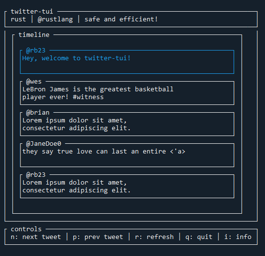

# mini-twitter-tui

:crab: lightweight in-terminal user-interface to view your twitter home timeline.

<figure>
  
</figure>

## Installation

#### What You Need
* [Twitter Developer Account](https://developer.twitter.com/en)
* [Twitter Developer API key and secret-key](https://developer.twitter.com/en/portal/dashboard)

#### Run
1. ```git clone https://github.com/RyanDBurke/mini-twitter-tui.git```
2. ```cargo run```

## Concluding Thoughts
```
I built this little project as my introduction into Rust! I learned a ton about Rust's
ownership/borrowing paradigm, lifetimes <'a>, and memory-safety. The UI is as lightweight
as it gets and in the future I'd like to add more UI-features, but doing so would probably involve
writing a new rust-twitter library (the ones that exist are great, but miss some crucial features) or
waiting for Rust's web development to mature a bit more. Also, some write-permission to allow tweets
to be submitted would be pretty cool! Nevertheless I've enjoyed my first Rust
project and can't wait to get more acquainted with the language.
```

##
<em>Inspired by [spotify-tui](https://github.com/Rigellute/spotify-tui)</em> </br>
<em>I used this [rust-twitter-library](https://github.com/egg-mode-rs/egg-mode)</em>
